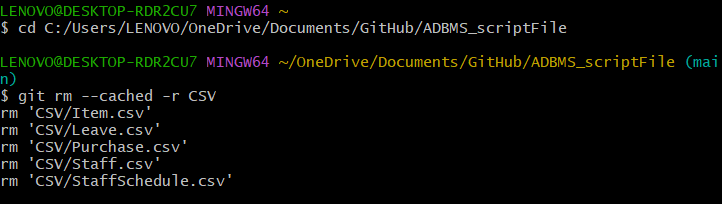

To understand how to using GitHub Fork, pls read this [GitHub Fork Documentation](https://docs.github.com/en/pull-requests/collaborating-with-pull-requests/working-with-forks/fork-a-repo)

### GitHub version control command ( Git Bash )
- use for remove the tracking to the file or folder 
```
cd C:/Users/LENOVO/OneDrive/Documents/GitHub/ADBMS_scriptFile

git rm --cached -r <file or folder path>
```




#### Cherry-pick 
- using cherry-pick can let us to only select the specified commit and merge the commit to the other branch or main  
- in this scenario, we can create a new branch with using base ( either main or other branch ) and using cherry-pick to merge the commit want to merge to main branch or main repo, so that the other content wont be merge to that repo / branch / main 

    | FROM      | TO        |        |
    | :---:     | :---:     | :---:  |
    | Main      | Main      | ❌    |
    | Main      | Branch    | ✅    |
    | Branch    | Main      | ✅    |
    | Branch1   | Branch1   | ❌    |
    | Branch1   | Branch2   | ✅    |

- Link : [Cherry-pick on GitHub Desktop](https://docs.github.com/en/desktop/managing-commits/cherry-picking-a-commit-in-github-desktop)

